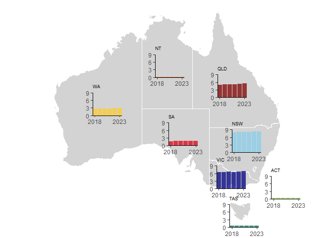

<!-- README.md is generated from README.Rmd. Please edit that file -->

# template_chart_overlay_on_map

<!-- badges: start -->
<!-- badges: end -->

The goal of template_chart_overlay_on_map is to make available an easy
to use template for plotting charts over a map base.

    #> ── Attaching core tidyverse packages ───────── tidyverse 2.0.0 ──
    #> ✔ dplyr     1.1.4     ✔ readr     2.1.5
    #> ✔ forcats   1.0.0     ✔ stringr   1.5.1
    #> ✔ ggplot2   3.5.0     ✔ tibble    3.2.1
    #> ✔ lubridate 1.9.3     ✔ tidyr     1.3.1
    #> ✔ purrr     1.0.2     
    #> ── Conflicts ─────────────────────────── tidyverse_conflicts() ──
    #> ✖ dplyr::filter() masks stats::filter()
    #> ✖ dplyr::lag()    masks stats::lag()
    #> ℹ Use the conflicted package (<http://conflicted.r-lib.org/>) to force all conflicts to become errors
    #> Joining with `by = join_by(state_name)`
    #> Warning: There was 1 warning in `mutate()`.
    #> ℹ In argument: `subplots = list(...)`.
    #> ℹ In row 1.
    #> Caused by warning:
    #> ! The `<scale>` argument of `guides()` cannot be `FALSE`. Use
    #>   "none" instead as of ggplot2 3.3.4.

``` r
plot(map.with.grobs)
```

<!-- -->
